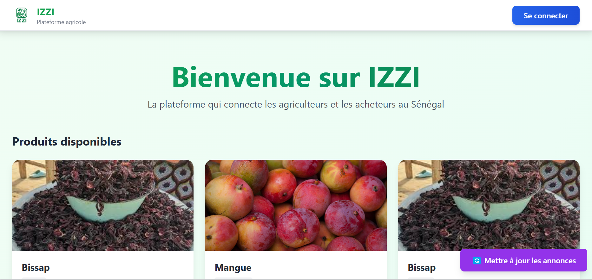

# IZZI -- Application de mise en relation producteurs--acheteurs

## 🌾 Problème

Selon le rapport *Feed the Future* de l'IPAR (2022), le département de
Podor a enregistré plus de **5,6 milliards FCFA de pertes de
récoltes**.\
Chaque année, des milliards sont perdus au Sénégal simplement parce que
**producteurs et acheteurs ne sont pas connectés**.

------------------------------------------------------------------------

## 🚀 Solution : IZZI

IZZI est une application multifonction qui **connecte producteurs et
acheteurs**,\
**avec ou sans internet**, et accessible à tous les profils :

-   Agriculteurs analphabètes avec smartphone\
-   Agriculteurs avec téléphones basiques\
-   Agriculteurs alphabètes avec smartphone\
-   Acheteurs (grossistes, transformateurs, supermarchés, restaurants,
    etc.)

------------------------------------------------------------------------

## 🎯 Marché cible

-   Producteurs agricoles\
-   Acteurs économiques\
-   Transformateurs, commerçants, supermarchés, restaurateurs, etc.

------------------------------------------------------------------------

## 💼 Modèle économique

-   **Frais de publication : 250 FCFA / annonce**
-   **Partenariats B2B** avec ONG et acteurs de développement
-   **Publicité ciblée** sur les produits agricoles

------------------------------------------------------------------------

## 🔑 Innovations

-   Accessibilité universelle (langues locales, interface simple)
-   Reconnaissance vocale pour publier une annonce facilement
-   Automatisation du cycle de vente
-   Fonctionnement avec ou sans connexion Internet

------------------------------------------------------------------------

## 🌱 Impact

**Social** - Inclusion des producteurs sans smartphone / sans internet\
- Réduction de l'insécurité alimentaire

**Environnemental** - Moins de pertes post-récolte → réduction du
gaspillage\
- Utilisation plus efficace des terres

**Économique** - Augmentation des revenus\
- Meilleure visibilité et rapidité de vente\
- Marché structuré et traçable

------------------------------------------------------------------------

## 🔮 Perspectives d'avenir

-   Transcription multilingue (français/anglais + langues locales)
-   Extraction automatique : produit, quantité, prix, lieu, contact
-   Accessibilité totale pour utilisateurs sans smartphone
-   Automatisation renforcée du processus annonce → vente

------------------------------------------------------------------------

## 🌍 Stratégie de croissance

1.  **Région pilote**\
2.  **Extension nationale** (web + mobile)\
3.  **Scalabilité CEDEAO**

------------------------------------------------------------------------

## 👥 Équipe

-   Aminata BA -- Licence 3 Big Data\
-   Anta NGOM -- Licence 3 Big Data\
-   Baba BA -- Data Analyste / Scientifique\
-   Leslye NKWA -- Cycle Ingénieurs Statistique Économique\
-   Ben Idriss DILOMA -- Cycle Ingénieurs Statistique Économique
